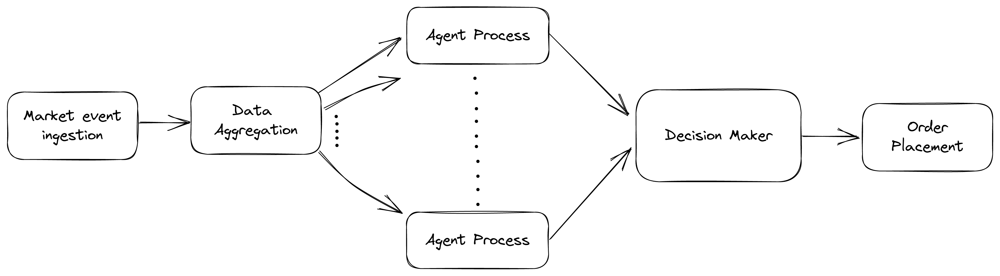

# Hftx


Automated trading platform written with Elixir. It uses zerodha's kite trading APIs to track market and place orders.

# Architecture

This diagram describes Hftx's architecture at a high level.

<p align="center">
  
</p>

## Project Structure
The Hftx project contains the following components

- [Zerodha Integration](lib/hftx/zerodha/)
- [Worker Process Definitions](lib/hftx/workers/)
- [Data Aggregation Strategies](lib/hftx/strategies/data_transformer/)
- [Trader Strategies](lib/hftx/strategies/trader/)
- [Decision Making Strategies](lib/hftx/strategies/decision_maker/)
- TODO: Persistence

### Zerodha Integration

#### [API](lib/hftx/zerodha/api/)
This set of modules contains fns to communicate with Zerodha kite trade APIs.

#### [WebSocket](lib/hftx/zerodha/web_socket/web_socket.ex)
This module contains the implementation for a websocket process that will listen to the market events from the zerodha's websocket API

The [Frame](lib/hftx/zerodha/web_socket/frame.ex) module contains fns that help operate on the binary frame sent by zerodha over websockets

#### [TokenStore](lib/hftx/zerodha/token_store.ex)
This module acts as a in-memory store for the access_token. This module would be used whenever access_token is require to call the zerodha APIs.

#### [Supervisor](lib/hftx/zerodha/supervisor.ex)
This module describes a `Supervisor` process that will initialize and supervise the zerodha related processes - [TokenStore](lib/hftx/zerodha/token_store.ex) & [WebSocket](lib/hftx/zerodha/web_socket/web_socket.ex)

### Worker Process Definitions
These modules contain the definition of worker processes for [Trader](lib/hftx/workers/trader.ex), [DataTransformer](lib/hftx/workers/data_transformer.ex) and [DecisionMaker](lib/hftx/workers/decision_maker.ex)

#### [Trader](lib/hftx/workers/trader.ex)
A `:gen_statem` process that simulates a trader as an FSM. This worker will consume aggregate market events for a market instrument and give a [suggestion](lib/hftx/data/trader/suggestion.ex) based on the active [strategy](lib/hftx/strategies/trader)

These suggestions are then forwarded to the [decision maker process](lib/hftx/workers/decision_maker.ex) for that instrument

In a typical run of the system, there would be multiple traders running for every market instrument under watch. And each of these trader would be implementing a different strategy to evaluate the market events

#### [DataTransformer](lib/hftx/workers/data_transformer.ex)
A `GenServer` process that transformer the incoming stream of market event into an aggregate data. This process is initialized with a [strategy](lib/hftx/strategies/data_transformer), which determines how the market event stream is converted into an aggregate data struct

The aggregate data structs are then forwarded to all the [trader worker processes](lib/hftx/workers/trader.ex) for that instrument

There would be one `data_transformer` working on one market instrument

#### [DecisionMaker](lib/hftx/workers/decision_maker.ex)
A `GenServer` process that consumes the suggestions from various traders and takes the final action based on the suggestions. This process is initialized with a [decision making strategies](lib/hftx/strategies/decision_maker)

### Data Aggregation Strategies
These are set of modules that specify data transformation strategies. The base behaviour can be found [here](lib/hftx/strategies/data_transformer/data_transformer.ex)

Operating on a raw stream on market events maybe too computationally intensive. The raison d'etre for these modules is to convert the incoming market event data stream into an [aggreagte](lib/hftx/data/aggregate/aggregate.ex) form. The intent is to create an aggregate data struct, which conveys more or less the same information as the raw market event data stream that it represents. The [TraderWorker](lib/hftx/workers/trader.ex) can then operate on the aggregate rather than the original stream.

An example `data transformer strategy` can be found [here](lib/hftx/strategies/data_transformer/candle_stick.ex). This strategy converts a list of market event data into [CandleStick](lib/hftx/data/aggregate/candle_stick.ex) data struct

### Trader Strategies
These are set of modules that specify the strategies which can be injected in the trader worker processes.

These strategies take a list of aggregate market data event and respond back with a suggestion. The base behaviour for this strategy can be found [here](lib/hftx/strategies/trader/trader.ex)

An example `trader worker strategy` can be found [here](lib/hftx/strategies/trader/always_long.ex). This is a dummy strategy that always suggests going `:long` on the instrument

### Decision Making Strategies
These are set of modules that specify the decision making strategies. The base behaviour can be found [here](lib/hftx/strategies/decision_maker/decision_maker.ex)

These strategies define the algorithm to consume the [suggestions](lib/hftx/data/trader/suggestion.ex) generated by the trader worker processes and take the final decision on them.

And example `decision maker strategy` can be found [here](lib/hftx/strategies/decision_maker/naive.ex). This is a dummy strategy which just picks the latest suggestion by the traders.

### Persistence
*TODO*

This module doesn't exist yet, when it does it will help persist the orders, the decisions and the circumstances underwhich those decisions were taken.

# Configuration

# Local setup
- Install [docker](https://www.docker.com/products/docker-desktop/)
- Install [elixir](https://elixir-lang.org/install.html) v1.12 or later
  - [asdf](https://asdf-vm.com/) is a good tool for managing multiple versions of elixir (and other languages for that matter)

Once the local dependencies are met, run the following:

``` sh
make run
```

# Testing

## Unit tests
``` sh
make test
```

## Backtesting
This will run Hftx app against the data in the `priv/backtest_data.csv` file.
``` sh
make backtest
```
The result of the backtest can be obtained by running the following command in the above shell
``` elixir
Hftx.Backtesting.OrderHistory.statement(<instrument_name>)
```
There's also a [yfin.py](dev/yfin.py) python script that can be used to download 1m interval data for other instruments.
